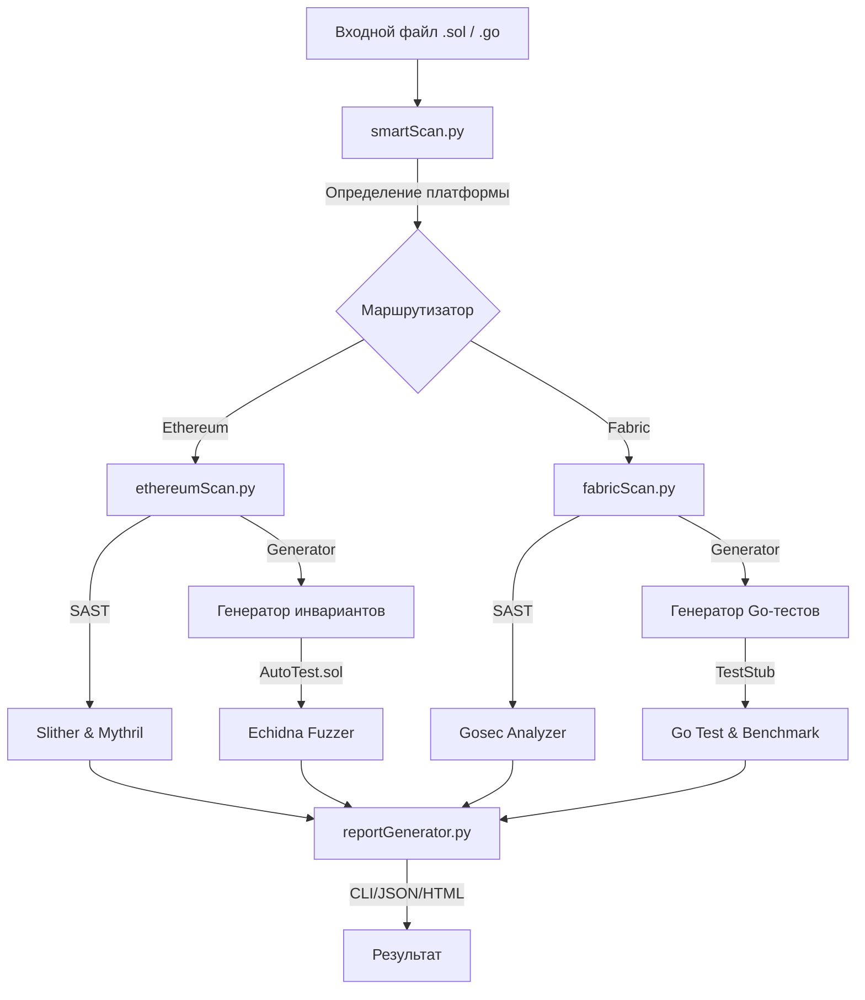

SmartScan: Комплексный анализатор безопасности смарт-контрактов

SmartScan — это модульная система для автоматизированного поиска уязвимостей в смарт-контрактах Ethereum (Solidity) и Hyperledger Fabric (Go). Инструмент объединяет статический анализ (SAST) и динамическое тестирование (DAST/Fuzzing), предоставляя единый отчет.

1. Архитектура прототипа

Система построена на языке Python и состоит из следующих модулей:



smartScan.py: Контроллер приложения.

ethereumScan.py: Интеграция Slither, Mythril и генератор инвариантов для Echidna.

fabricScan.py: Интеграция Gosec и генератор Unit-тестов на Go (MockStub).

reportGenerator.py: Агрегатор данных и генератор отчетов.

2. Возможности обнаружения уязвимостей

Система способна выявлять широкий спектр проблем безопасности, специфичных для каждой платформы.

Ethereum (Solidity)

Используемые инструменты: Slither, Mythril, Echidna

Критические уязвимости (High/Critical):

Reentrancy (Повторный вход): Атаки на вывод средств до обновления баланса.

Unchecked Low-level Calls: Игнорирование возвращаемых значений call/delegatecall.

Access Control: Отсутствие модификаторов (например, onlyOwner) у критических функций.

Suicidal Contracts: Функции, позволяющие любому уничтожить контракт (selfdestruct).

Integer Overflow/Underflow: (Для старых версий Solidity < 0.8.0).

Логические и средние уязвимости (Medium):

Block Timestamp Dependence: Использование времени блока для критической логики (манипулируемо майнерами).

Weak Randomness: Небезопасная генерация псевдослучайных чисел.

Tx.Origin: Использование tx.origin для аутентификации (уязвимость к фишингу).

Информационные (Low/Info):

Оптимизация газа (Gas loops, Unused variables).

Нарушение Style Guide (именование переменных).

Hyperledger Fabric (Chaincode Go)

Используемые инструменты: Gosec, Custom Linter, Go Test

Специфичные для блокчейна (Critical):

Недетерминизм (Non-determinism): Использование math/rand, time.Now(), итерации по map (без сортировки). Это приводит к нарушению консенсуса (Ledger Fork).

Concurrency Issues: Использование горутин (go func) внутри чейнкода (возможны гонки данных при чтении/записи в World State).

Общие уязвимости безопасности (High/Medium):

Unhandled Errors: Игнорирование ошибок при записи (PutState) или чтении (GetState).

SQL Injection: Уязвимости в Rich Queries (CouchDB) при формировании запросов строк.

Hardcoded Credentials: Жестко заданные ключи или пароли в коде.

Отказ в обслуживании (DoS):

Panic: Деление на ноль или выход за границы массива, приводящие к падению контейнера чейнкода.

3. Установка и настройка

Системные требования

OS: Linux (Ubuntu 20.04/22.04) / macOS.

Python 3.10+: Основной язык анализатора.

Go 1.21+: Необходим для анализа чейнкода Fabric.

Docker: Требуется только для работы CI/CD пайплайнов и развертывания полноценных локальных сетей Fabric. Для локального статического анализа Docker не обязателен.

Автоматическая установка (Рекомендуется)

Для быстрой настройки окружения используйте скрипт инициализации:

```
chmod +x init.sh
./init.sh
source ~/.bashrc
```

Управление версиями Solidity

Проект использует инструмент solc-select. Это позволяет анализировать контракты, написанные на разных версиях языка.

Установить версию: solc-select install 0.8.20

Переключить версию: solc-select use 0.8.20

Посмотреть текущую: solc --version

4. Эксплуатация

Запуск анализа

Используйте основной скрипт smartScan.py. Тип анализа определяется автоматически по расширению файла.

Пример для Ethereum:

```
python3 smartScan.py contracts/eth/Reentrancy.sol --html --myth
```

--html: Сгенерировать HTML-отчет (JSON создается всегда).

--myth: Включить глубокий символьный анализ Mythril (может занять до 2 минут).

Пример для Fabric:

```
python3 smartScan.py contracts/fabric/AssetTransfer.go --html
```

5. Форматы данных

Входные данные

Solidity: Файлы .sol версии 0.8.x. (для работы с другими версиямо используйте solc-select)

Go: Файлы .go, содержащие структуру чейнкода Fabric.

Выходные данные

Отчеты сохраняются в папку reports/ в двух форматах.

Пример JSON-отчета:

{
    "timestamp": "2026-01-19 12:00:00",
    "platform": "Ethereum",
    "static_analysis": [
        {
            "tool": "Slither",
            "type": "reentrancy-eth",
            "severity": "High",
            "location": "contracts/eth/Reentrancy.sol#15"
        }
    ],
    "dynamic_analysis": [
        {
            "tool": "Echidna",
            "status": "FAIL",
            "evidence": "Call Sequence: deposit -> withdraw -> fallback"
        }
    ]
}

5. CI/CD Интеграция

SmartScan поддерживает встраивание в конвейеры разработки (DevSecOps). В репозитории предусмотрен файл конфигурации для GitHub Actions.
При каждом git push система:

Разворачивает окружение.

Сканирует все .sol и .go файлы.

Сохраняет отчеты как артефакты сборки.