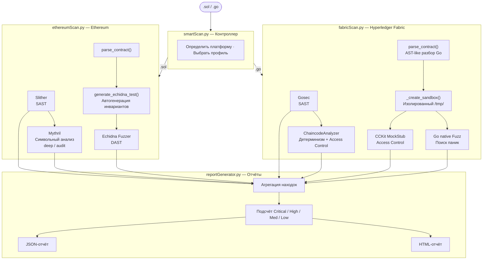

SmartScan: Комплексный анализатор безопасности смарт-контрактов

SmartScan — модульная система автоматизированного поиска уязвимостей в смарт-контрактах Ethereum (Solidity) и Hyperledger Fabric (Go). Инструмент объединяет статический анализ (SAST), символьное исполнение и динамическое фаззинг-тестирование (DAST), предоставляя единый структурированный отчёт.

1. [Архитектура системы](#1-архитектура-системы)
2. [Возможности обнаружения уязвимостей](#2-возможности-обнаружения-уязвимостей)
3. [Установка и настройка](#3-установка-и-настройка)
4. [Эксплуатация и профили анализа](#4-эксплуатация-и-профили-анализа)
5. [Интеграция в процесс безопасной разработки (CI/CD)](#5-интеграция-в-процесс-безопасной-разработки-cicd)
6. [Регламент реагирования на уязвимости](#6-регламент-реагирования-на-уязвимости)
7. [База знаний: каталог уязвимостей и Best Practices](#7-база-знаний-каталог-уязвимостей-и-best-practices)
8. [Форматы данных](#8-форматы-данных)
9. [Выводы о применимости методики](#9-выводы-о-применимости-методики)

## 1. Архитектура системы

Система построена на языке Python и состоит из следующих модулей:


**Модули системы:**

`smartScan.py` — контроллер: разбирает аргументы, определяет платформу по расширению файла, выбирает набор инструментов согласно профилю.

`ethereumScan.py` — оркестрация Slither, Mythril и автоматической генерации Echidna-тестов с адаптивными инвариантами (ERC-20, payable, solvency).

`fabricScan.py` — AST-like парсинг Go-файла, интеграция Gosec и генерация изолированных Go-тестов (CCKit MockStub, Go native fuzz) в песочнице `/tmp`.

`reportGenerator.py` — агрегатор: собирает находки всех инструментов, рассчитывает сводку по severity, экспортирует JSON и HTML.


## 2. Возможности обнаружения уязвимостей

### Ethereum (Solidity)

| Уязвимость | Инструмент | Severity | Класс SWC |
|---|---|---|---|
| Reentrancy | Slither, Mythril, Echidna | High | SWC-107 |
| Unchecked low-level call | Slither | Medium | SWC-104 |
| Access Control | Slither | High | SWC-105 |
| Suicidal contract | Slither | High | SWC-106 |
| Integer overflow/underflow | Slither | High | SWC-101 |
| Block timestamp dependence | Slither, Mythril | Medium | SWC-116 |
| Weak randomness (tx.origin / blockhash) | Slither | Medium | SWC-120 |
| Transaction Order Dependence | Mythril | Medium | SWC-114 |
| Нарушение инварианта баланса (drain) | Echidna | Critical | — |

### Hyperledger Fabric (Go Chaincode)

| Уязвимость | Инструмент | Severity |
|---|---|---|
| Недетерминизм: `math/rand`, `time.Now()` | Gosec G404, ChaincodeAnalyzer | Critical |
| Недетерминизм: горутины в чейнкоде | ChaincodeAnalyzer | Critical |
| Недетерминизм: Rich Query без сортировки | ChaincodeAnalyzer | Medium |
| Отсутствие Access Control в write-методах | ChaincodeAnalyzer + CCKit | High |
| Непроверенный результат `PutState` | Gosec G104, ChaincodeAnalyzer | High |
| Паника при граничных входных данных | Go Fuzz | High |
| Hardcoded credentials | Gosec G101 | High |

---

## 3. Установка и настройка

### Системные требования

| Компонент | Версия | Назначение |
|---|---|---|
| OS | Ubuntu 20.04 / 22.04 / macOS | Основная платформа |
| Python | 3.10+ | Ядро анализатора |
| Go | 1.21+ | Анализ Fabric-чейнкода |
| Slither | ≥ 0.11 | Ethereum SAST |
| Mythril | ≥ 0.24.7 | Символьное исполнение |
| Echidna | 2.3.2 | Ethereum fuzzing |
| Gosec | 2.20.0 | Go SAST |
| Docker | 24+ | CI/CD, опционально |

### Автоматическая установка

```bash
chmod +x init.sh
./init.sh
source ~/.bashrc
```

Скрипт устанавливает все инструменты и предварительно кэширует зависимости Hyperledger Fabric, что ускоряет последующие запуски динамического анализа.

### Установка через Docker

```bash
docker build -t smartscan:latest .
# Ethereum
docker run --rm -v $(pwd)/contracts:/app/contracts -v $(pwd)/reports:/app/reports \
  smartscan:latest contracts/eth/MyContract.sol --profile deep --html
# Fabric
docker run --rm -v $(pwd)/contracts:/app/contracts -v $(pwd)/reports:/app/reports \
  smartscan:latest contracts/fabric/MyChaincode.go --profile audit --html
```

### Установка через Vagrant (на виртуальнй машине)

```bash
vagrant up
```

### Управление версиями Solidity

```bash
solc-select install 0.8.20   # установить версию
solc-select use 0.8.20       # переключить
solc --version               # проверить текущую
```

---

## 4. Эксплуатация и профили анализа

### Профили

| Профиль | Инструменты | Время | Назначение |
|---|---|---|---|
| `fast` | Slither + Gosec + ChaincodeAnalyzer | 10–30 с | Каждый коммит, CI на PR |
| `deep` | `fast` + Echidna (5k итераций) + Mythril (30 с) + CCKit | 2–5 мин | Pre-merge проверка |
| `audit` | `deep` + Mythril (90 с) + Go native Fuzz (20 с) + CCKit | 5–15 мин | Перед продакшн-деплоем |

### Запуск

```bash
# Ethereum — быстрая проверка
python3 smartScan.py contracts/eth/Token.sol --profile fast

# Ethereum — полный аудит с HTML-отчётом
python3 smartScan.py contracts/eth/Reentrancy.sol --profile audit --html

# Fabric — deep-анализ (CCKit Access Control)
python3 smartScan.py contracts/fabric/AssetTransfer.go --profile deep --html

# Fabric — полный аудит (CCKit + Fuzz)
python3 smartScan.py contracts/fabric/VulnerableFabric.go --profile audit --html
```

### Echidna и готовые наборы инвариантов (defi-invariants)

Для анализа DeFi-контрактов SmartScan поддерживает интеграцию с библиотекой готовых инвариантов **[crytic/properties](https://github.com/crytic/properties)** (ранее известной как `defi-invariants`). Это коллекция формально верифицированных свойств безопасности для стандартных токенов и DeFi-протоколов.

---

## 5. Интеграция в процесс безопасной разработки (CI/CD)

### Стратегия по ветке/событию

| Событие | Профиль | Job | Время |
|---|---|---|---|
| Каждый `push` / `pull_request` | `fast` | `sast-fast` | ~30 с |
| `push` в `main` (после merge) | `deep` | `dast-audit` | ~5 мин |
| Ручной запуск / перед тегом | `audit` | `dast-audit` | ~15 мин |

Файл конфигурации: `.github/workflows/security.yml` (см. в репозитории).

### Pre-commit хук (локальная быстрая проверка)

Установка: `chmod +x .git/hooks/pre-commit`

## 6. Регламент реагирования на уязвимости

### Матрица приоритетов реагирования

| Severity | SLA реагирования | Действие | Блокирует деплой |
|---|---|---|---|
| CRITICAL | Немедленно (0 ч) | Остановка работ, hotfix | Да |
| HIGH | 24 часа | Назначение задачи, ветка fix/ | Да |
| MEDIUM | 72 часа | Планирование в ближайший спринт | Нет (с Risk Acceptance) |
| LOW / INFO | Следующий релиз | Технический долг, документирование | Нет |

### Процесс реагирования

```
Обнаружена уязвимость SmartScan
           │
           ▼
    Severity == CRITICAL?
     ├─ Да ──► Заморозить ветку → Создать security advisory → Hotfix → Повторный аудит
     └─ Нет
           │
           ▼
    Severity == HIGH?
     ├─ Да ──► Создать задачу HIGH-PRIORITY → Ветка fix/<issue> → Code Review → Re-scan
     └─ Нет ──► Внести в backlog → Закрыть в ближайшем спринте
```

---

## 7. База знаний: каталог уязвимостей и Best Practices

### Ethereum / Solidity

**Reentrancy (SWC-107)**

```solidity
//  Уязвимо: внешний вызов до изменения состояния
function withdraw() external {
    uint bal = balances[msg.sender];
    (bool sent,) = msg.sender.call{value: bal}("");
    balances[msg.sender] = 0; // состояние меняется ПОСЛЕ вызова
}

//  Безопасно: Checks-Effects-Interactions
function withdraw() external nonReentrant {
    uint bal = balances[msg.sender];
    balances[msg.sender] = 0;        // 1. Effects
    (bool sent,) = msg.sender.call{value: bal}(""); // 2. Interaction
    require(sent, "Transfer failed");
}
```

**Access Control (SWC-105)**

```solidity
//  Уязвимо: любой может вызвать
function setOwner(address newOwner) external {
    owner = newOwner;
}

//  Безопасно: модификатор onlyOwner
modifier onlyOwner() {
    require(msg.sender == owner, "Not owner");
    _;
}
function setOwner(address newOwner) external onlyOwner {
    owner = newOwner;
}
```

**Weak Randomness (SWC-120)**

```solidity
//  Уязвимо: предсказуемо для майнеров
uint random = uint(keccak256(abi.encodePacked(block.timestamp, block.difficulty)));

//  Безопасно: Chainlink VRF (верифицируемая случайность)
function requestRandomWords() external returns (uint256 requestId) {
    return COORDINATOR.requestRandomWords(keyHash, subscriptionId, 3, 100000, 1);
}
```

### Hyperledger Fabric / Go Chaincode

**Недетерминизм: генератор случайных чисел**

```go
//  Уязвимо: rand.Intn даёт разные значения на разных пирах
rand.Seed(time.Now().UnixNano())
value := rand.Intn(100)

//  Безопасно: используем хэш TxID как детерминированный источник
txID := ctx.GetStub().GetTxID()
hash := sha256.Sum256([]byte(txID))
value := int(hash[0]) % 100
```

**Недетерминизм: время**

```go
//  Уязвимо: time.Now() различается на каждом пире
timestamp := time.Now().Unix()

//  Безопасно: время транзакции из блока (одинаково для всех пиров)
txTimestamp, err := ctx.GetStub().GetTxTimestamp()
timestamp := txTimestamp.Seconds
```

**Access Control**

```go
//  Уязвимо: любой участник сети может изменить данные
func (s *SmartContract) UpdateAsset(ctx contractapi.TransactionContextInterface,
    id string, newValue int) error {
    // нет проверки прав
    return ctx.GetStub().PutState(id, ...)
}

//  Безопасно: проверка MSP-идентификатора
func (s *SmartContract) UpdateAsset(ctx contractapi.TransactionContextInterface,
    id string, newValue int) error {
    mspID, err := cid.GetMSPID(ctx.GetStub())
    if err != nil || mspID != "AdminMSP" {
        return fmt.Errorf("access denied: only AdminMSP can update assets")
    }
    return ctx.GetStub().PutState(id, ...)
}
```

**Обработка ошибок PutState**

```go
//  Уязвимо: ошибка записи игнорируется
ctx.GetStub().PutState(id, data)
return nil

//  Безопасно: всегда проверяем ошибку
if err := ctx.GetStub().PutState(id, data); err != nil {
    return fmt.Errorf("failed to write state for %s: %w", id, err)
}
```

---

## 8. Форматы данных

### Входные данные

**Solidity**: Файлы .sol версии 0.8.x. (для работы с другими версиямо используйте solc-select)

**Go**: Файлы .go, содержащие структуру чейнкода Fabric.

### Выходные данные

Отчеты сохраняются в папку reports/ в формате json и дополнительно в формате html.

**JSON-отчёт (структура)**

```json
{
    "timestamp": "2026-01-01 12:00:00",
    "platform": "Ethereum | Hyperledger Fabric",
    "target_file": "/path/to/contract",
    "static_analysis": [
        {
            "tool": "Slither | Gosec | ChaincodeAnalyzer | Mythril",
            "type": "reentrancy-eth | G404 | NonDeterminism/MathRand | ...",
            "severity": "Critical | High | Medium | Low | Informational",
            "description": "Подробное описание уязвимости",
            "location": "Line: 34"
        }
    ],
    "dynamic_analysis": [
        {
            "tool": "Echidna | Fabric-CCKit | Fabric-Fuzzing",
            "description": "Описание результата",
            "status": "PASS | FAIL | ERROR | TIMEOUT",
            "evidence": "Трасса вызовов или сообщение об ошибке"
        }
    ],
    "summary": {
        "critical": 0,
        "high": 2,
        "medium": 1,
        "low": 3
    }
}
```

---

## 9. Выводы о применимости методики

### Рекомендации по применению

Для продакшн-деплоя рекомендуется использовать профиль `audit` в сочетании с ручной проверкой выводов CRITICAL и HIGH severity. Для учебных и тестовых контрактов без ролевой модели (таких как `asset_transfer.go`) предупреждения `AccessControl/MissingCheck` могут быть обоснованно проигнорированы с фиксацией в документации.

